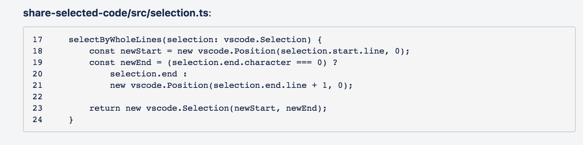

# Share Selected Code

This VSCode extension helps you share your code to sites like JIRA and Slack.
It formats the selected code according to the site's style.

Here is an example for JIRA (without comments):

```
*share-selected-code/src/selection.ts*:

{noformat}
17     selectByWholeLines(selection: vscode.Selection) {
18         const newStart = new vscode.Position(selection.start.line, 0);
19         const newEnd = (selection.end.character === 0) ?
20             selection.end :
21             new vscode.Position(selection.end.line + 1, 0);
22
23         return new vscode.Selection(newStart, newEnd);
24     }
{noformat}
```

Screenshot of the above in JIRA:



## Features

* Currently supports: JIRA and Slack
* Includes line numbers
* Include the path to the file, relative to the repo path
* Handles multiple selections correctly

## Requirements

This has been tested on Visual Studio Code 1.26.0.

## Extension Settings

There are currently two commands:

*extension.shareSelectionAndPath.slack*

*extension.shareSelectionAndPath.jira*

**Enjoy!!**
